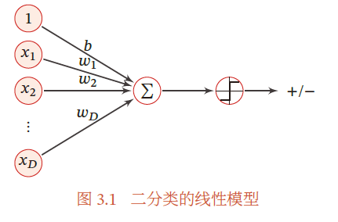
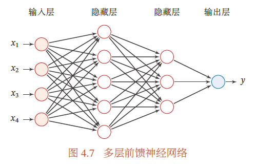

# ANN(Artificial Neural Network)

人工神经网络

实训任务 I

- 掌握感知机、BP神经网络
- 掌握均方误差损失函数
- 完成基于logistic/softmax regression的分类模型

## 从感知机出发

### Preceptron

感知机是一种经典的线性分类模型.

$$f(\mathbb{x}) = h(\mathbb{w}^T \mathbb{x}+b)$$

- $\mathbb{w}$: 权重向量
- $\mathbb{x}$: 输入向量
- $b$: 偏置项
- $h(\cdot)$: 激活函数

对于感知机, 它采用的激活函数是符号函数:

$$y=\operatorname{sgn}(\mathbb{w}^T \mathbb{x}+b)$$

- 即, 当 $\mathbb{w}^T \mathbb{x}+b$ 是正数时, 输出 $y=1$; 当为 0 时, 输出 $y=0$; 如果是负数的话则输出 $y=-1$.
- 在一些文献里, 截距项可能不作为学习参数

它对应特征空间中的分离超平面:

$$\mathbb{w}^T \mathbb{x}+b=0$$

### 学习策略

$$
\min _{w, b} L(w, b)=-\sum_{x_{i} \in M} y_{i}\left(w \cdot x_{i}+b\right)
$$

最小化误分类点到超平面的总距离.

算法采用**随机梯度下降**(Stochastic Gradient Descent, SGD): 沿着损失函数梯度下降的方向更新参数, 随机抽取一个误分类点使其梯度下降.

$$w \leftarrow w + \eta y_{i}x_{i}$$

$$b \leftarrow b + \eta y_{i}$$

当实例点被误分类, 即位于分离超平面的错误侧, 则调整 $w$, $b$ 的值, 使分离超平面向该无分类点的一侧移动, 直至误分类点被正确分类.

## 前馈神经网络

最简单的 ANN 就是感知机, MP 神经元.

多添加几个神经元, 构成一个网络, 根据连接方式的不同区分为三类网络: 如果整个网络中的信息是朝一个方向传播, 构成一个有向无环图, 那么就是**前馈神经网络**(Feedforward Neural Network, FNN); 此外我们还有记忆网络, 以及图网络.

FNN 也被人称为**多层感知器**(MLP)[^1].

在前馈神经网络中, 各神经元分别属于不同的层.

每一层的神经元可以接收前一层神经元的信号, 并产生信号输出到下一层.

第 0 层称为输入层, 最后一层称为输出层, 其他中间层称为隐藏层. 整个网络中无反馈, 信号从输入层向输出层单向传播, 可用一个有向无环图表示.

- 每个神经层看作一个仿射变换 + 非线性变换

$$z^{(l)}=W^{(l)}\alpha^{(l-1)}+b^{(l)}$$

$$\alpha^{(l)}=f_l(z^{(l)})$$

**通用近似定理** 前馈神经网络具有很强的拟合能力, 常见的连续非线性函数都可以用前馈神经网络表示.

因为神经网络的强大能力, 反而容易在训练集上过拟合.

### 参数学习

均方误差损失函数

交叉熵损失函数

## BP 神经网络

---

[^1]: 但注意 Preceptron 的激活函数和 FNN 的激活函数不同, 这个说法并不是十分准确.
